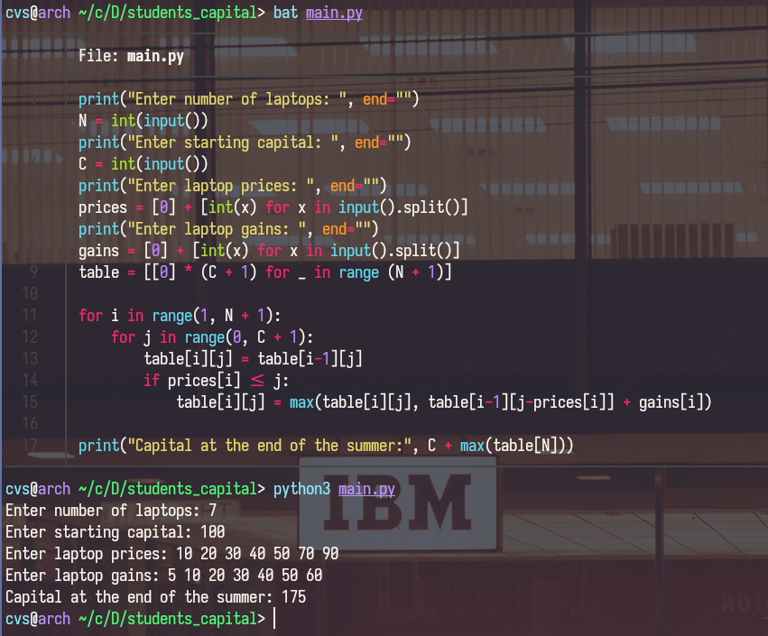

# Student's capital
## Task:
Imagine you are a student who makes money by buying, fixing, and selling laptops. You want to increase your capital this summer. As summer has a limited amount of time, you could only buy, fix, and resell a limited number of laptops, let’s say “N” distinct laptops. You need to increase your capital as much as possible.

You have “K” laptops, with laptop index “i”. You expect gains “gains[i]” for the laptop, the price of the laptop which would be “price[i]”. Initially, you would have a “C” amount of capital. When summer finishes, you will have profit, which will be added to your capital. 

You need to collect a list of at most “N” laptops you would buy to maximise your income. As a result, output the capital size that you would have after summer ends.

As a result, you should have a CLI application that receives inputs “N”, “C”, “gains array”, “price array” and output “capital at the end of the summer”. Please include instructions on how to run the application in README.md.
## Implementation:
Used dynamic programming approach to solve this problem. Algorithm complexity is *O(nW)*.
### Program execution example:
```sh
python3 main.go
```
### Output:

